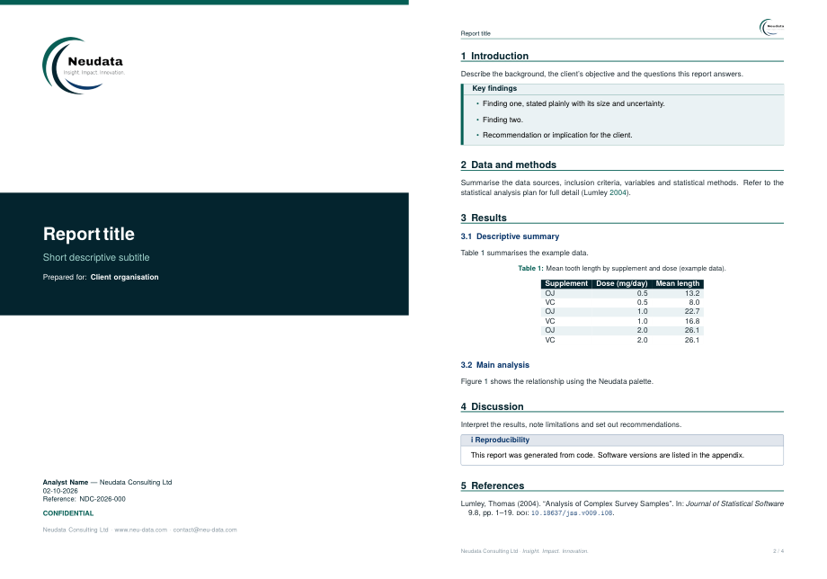
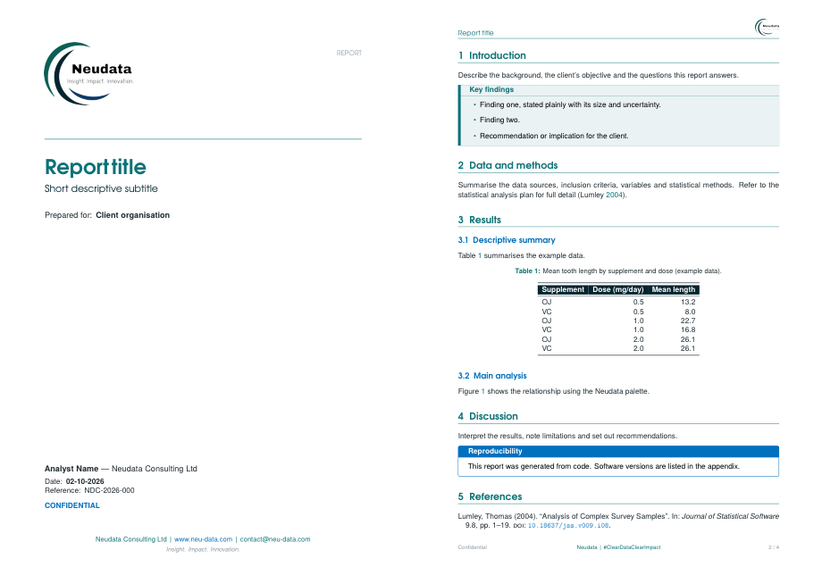

<div align="center">


# Neudata LaTeX document template

**Reports, proposals and technical notes in the Neudata house style — ready for Overleaf.**

[](https://www.overleaf.com/docs?snip_uri=https://raw.githubusercontent.com/neu-data/latex-report-template/main/overleaf.zip)


</div>

---

## Two styles, one class

Pick the look with a single class option:

| `\documentclass[style1]{neudata}` — **default** | `\documentclass[style2]{neudata}` |
|---|---|
| Matches the **Neudata Quarto report** | Matches the **Neudata PowerPoint template** |
|  |  |
| Teal top strip, navy cover band with white title | White cover, teal title, logo and rule |
| Navy headings over teal rules, blue sub-sections | Teal headings, blue sub-sections (Century Gothic look) |
| Abstract box, dotted table of contents | Summary box |
| Navy header row with striped table body | Navy header row with booktabs rules |
| Footer: *Neudata Consulting Ltd · Insight. Impact. Innovation.* | Footer: *Neudata \| #ClearDataClearImpact* |
| Example: [`main.tex`](main.tex) → [PDF](examples/example-style1.pdf) | Example: [`main-style2.tex`](main-style2.tex) → [PDF](examples/example-style2.pdf) |

## What you get in both

- **Cover page** — logo, title and subtitle, "Prepared for" client, author and affiliation, date, reference, version, classification and Neudata contact line
- **Headers and footers** — document title and logo above a teal rule; page `n / total`
- **`\abstract{}`** printed as a summary box after the cover
- **`keyfindings`** and **`neudatanote`** boxes
- **Navy table header rows** with `\neudataheader` and `\neudatath{}`
- **Closing copyright page** with `\neudatacopyrightpage`
- Author–year references with biblatex

## Use it on Overleaf

Click **Open in Overleaf** above, or download [`overleaf.zip`](overleaf.zip) and use **New Project → Upload Project**. Overleaf's default **pdfLaTeX** compiler and biber are used automatically.

The project contains both examples. `main.tex` (style 1) compiles by default; to see style 2, open **Menu → Main document** and choose `main-style2.tex`, or change `style1` to `style2` in the first line of `main.tex`.

## Use it locally

```bash
git clone https://github.com/neu-data/latex-report-template.git my-report
cd my-report
latexmk -pdf main.tex
```

## Front matter

```latex
\documentclass[style1, report]{neudata}   % style1 | style2; report | proposal | note; draft; nocover

\title{Report Title}
\subtitle{Short descriptive subtitle}
\author{Analyst Name, Neudata Consulting Ltd}
\client{Client organisation}
\reference{NDC-2026-000}
\version{1.0}
\confidentiality{Confidential}
% \date{29-04-2026}                   % defaults to today, DD-MM-YYYY
bstract{Executive summary shown in a box after the cover.}

\begin{document}
\maketitle
...
\neudatacopyrightpage
\end{document}
```

## Building blocks

```latex
\begin{keyfindings}
  \begin{itemize}
    \item Finding one, with its size and uncertainty.
  \end{itemize}
\end{keyfindings}

\begin{neudatanote}[Reproducibility]
  All results were produced from version-controlled code.
\end{neudatanote}

\begin{tabular}{lrr}
  \toprule
  \neudataheader \neudatath{Group} & \neudatath{N} & \neudatath{\%} \\
  \midrule
  Overall & 1,200 & 84.2 \\
  \bottomrule
\end{tabular}
```

Add `draft` to the class options for a DRAFT watermark.

---

<div align="center">

**Neudata Consulting Ltd** · *Insight. Impact. Innovation.*
[www.neu-data.com](https://www.neu-data.com) · [contact@neu-data.com](mailto:contact@neu-data.com)

</div>
